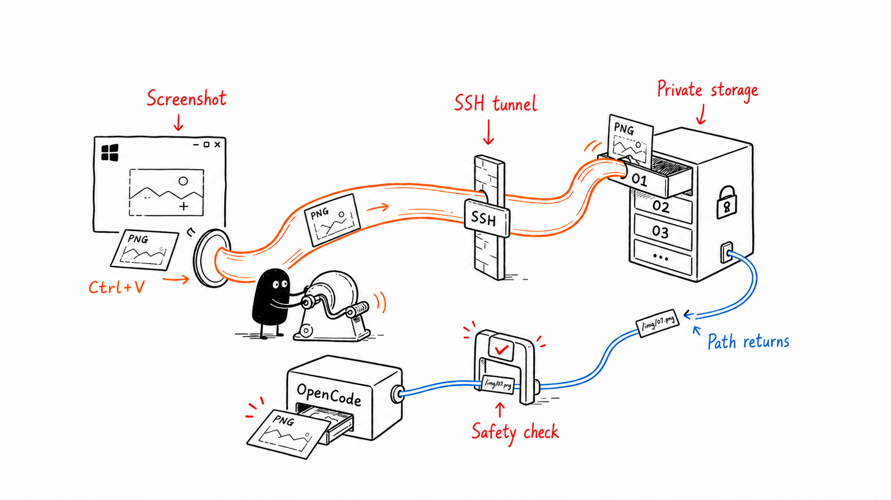

<p align="center">
  <b>English</b> ·
  <a href="README.zh-CN.md">简体中文</a>
</p>

<p align="center">
  
</p>

<p align="center">
  <a href="https://github.com/Empty-Jing/opencode-ssh-image-paste/releases/latest"></a>
  <a href="https://github.com/Empty-Jing/opencode-ssh-image-paste/actions/workflows/ci.yml"></a>
  <a href="LICENSE"></a>
</p>

<p align="center">
  <b>Paste Windows screenshots into a remote OpenCode session with the same Ctrl+V shortcut.</b><br>
  Text paste stays untouched. Image paste travels through your existing SSH connection.
</p>

<p align="center">
  <a href="#quick-start">Quick start</a> ·
  <a href="#features">Features</a> ·
  <a href="#how-it-works">How it works</a> ·
  <a href="#troubleshooting">Troubleshooting</a>
</p>

<p align="center">
  
  <br>
  <em>Capture → Ctrl+V → image appears in remote OpenCode.</em>
</p>

Regular SSH only transports terminal byte streams and cannot carry images from the Windows clipboard. This tool reads clipboard images locally on Windows, transfers them to a Linux receiver through a persistent OpenSSH subprocess, and invokes a private Windows Terminal `sendInput` action that atomically pastes the matching remote image path. OpenCode then recognizes the path as an image attachment. The image clipboard is never replaced or restored.

## Quick Start

You need:

- Windows 10/11 and Windows Terminal.
- Windows OpenSSH Client.
- Linux OpenSSH Server.
- Non-interactive SSH key or `ssh-agent` authentication from Windows to Linux.
- An OpenCode model that supports image input.

### 1. Install

Open PowerShell **as administrator** on Windows and run:

```powershell
iwr https://github.com/Empty-Jing/opencode-ssh-image-paste/releases/latest/download/bootstrap.ps1 -OutFile bootstrap.ps1 -ErrorAction Stop
.\bootstrap.ps1
```

Enter an SSH host or alias when prompted. By default, the installer creates a
per-user login task at the highest run level because the client must match an
administrator Windows Terminal's integrity level. The one-time installation or
update therefore requires elevation; subsequent logins do not display a UAC
prompt. The installer then checks SSH, detects the
remote Linux architecture, downloads checksum-verified release binaries, deploys
the receiver, installs and starts the Windows client, enables elevated startup at login,
and runs diagnostics.

Published Linux receivers for x86_64 and aarch64 are statically linked with
musl, so they do not depend on the remote distribution's glibc version.

For a non-interactive or auditable install, download the script first:

```powershell
iwr https://github.com/Empty-Jing/opencode-ssh-image-paste/releases/latest/download/bootstrap.ps1 -OutFile bootstrap.ps1
.\bootstrap.ps1 -SshTarget ubuntu-workbox
```

The SSH target must already accept host-key and key/`ssh-agent` authentication
without an interactive password prompt. Rust is not required for this install.

For a non-elevated Windows Terminal, explicitly opt out of the default elevated
task. Run this command from an administrator PowerShell when switching an
existing elevated installation so the old task can be removed:

```powershell
.\bootstrap.ps1 -SshTarget ubuntu-workbox -NonElevatedStartup
```

This creates a normal per-user Startup shortcut instead. A normal client cannot
inject input into an elevated Terminal; keep the default mode unless Terminal is
always run without administrator privileges.

### 2. Paste

1. Connect from Windows Terminal to Linux over SSH and start OpenCode directly or inside Herdr.
2. Capture a screenshot with `Win+Shift+S`.
3. Return to the original Windows Terminal window and press `Ctrl+V`.
4. The OpenCode input should show `[Image 1]`.

Text clipboard content continues to be pasted directly by Windows Terminal and does not use the image channel.

### 3. Verify

Check an existing installation at any time:

```powershell
& "$env:LOCALAPPDATA\Programs\OpenCodeSSHImagePaste\opencode-ssh-image-paste.exe" doctor
```

`doctor` checks the configuration, OpenSSH client, Windows Terminal and its
private paste action, SSH connection, remote receiver compatibility, and the
background client process.

To update, run the same quick-install command again from an administrator
PowerShell. It keeps the existing
configuration while replacing the local client and remote receiver.

### 4. Uninstall

Remove the Windows client, startup shortcut or elevated task, configuration, remote receiver,
and remote image cache:

```powershell
.\bootstrap.ps1 -Uninstall
```

Add `-KeepConfig` to preserve the local configuration. If the configuration is
missing, provide the remote explicitly with `-SshTarget ubuntu-workbox`. The
default elevated task also requires uninstall to run from an administrator
PowerShell.

## Features

- One exact `Ctrl+V` shortcut: text and modified combinations such as `Ctrl+Shift+V` pass through unchanged, while image-only clipboard content uses the bridge.
- Atomic terminal handoff: bootstrap adds 50 private slot actions without replacing Windows Terminal's normal `Ctrl+V` binding.
- Persistent SSH: the hot path does not start PowerShell, SCP, or a new SSH process.
- Safe cancellation: automatic paste is cancelled if the user changes windows, tabs, panes, keyboard input, mouse focus, or clipboard content during upload.
- Bounded private history: each paste uploads only its current image. The receiver directory uses `0700` and keeps the latest 50 successful pastes in `0600` image slots; the 51st successful paste replaces the oldest.
- Bounded protocol: encoded images are limited to 16 MiB, decoded results are checked for dimension, pixel, and RGBA-size limits, and responses are limited to 64 KiB.
- No additional credentials: authentication reuses OpenSSH configuration, host key verification, SSH keys, or `ssh-agent`.

See [`docs/design.md`](docs/design.md) for the complete architecture, protocol, state machine, and threat model.

## How It Works

<p align="center">
  
</p>

1. **Capture:** `Ctrl+V` reads the Windows clipboard image and encodes it as PNG in memory.
2. **Transfer:** A persistent OpenSSH process sends the PNG to one of 50 private Linux receiver slots and returns its exact path.
3. **Hand off:** After focus, input, and clipboard safety checks pass, Windows Terminal atomically sends that path to OpenCode.

Only the small path comes back. The original Windows image clipboard is never replaced.

## Troubleshooting

If installation stops at `Testing SSH connection`, first verify that the target
can connect without prompts:

```powershell
ssh -o BatchMode=yes -n -T ubuntu-workbox "printf ready"
```

The command must print `ready` and exit. If it does not, connect once with normal
`ssh ubuntu-workbox` to accept the host key and configure key or `ssh-agent`
authentication.

See the [Troubleshooting Guide](docs/troubleshooting.md) for download failures,
old background processes, taskbar windows, image paste failures, receiver checks,
and complete uninstall instructions.

## Build and Install Manually

Building from source requires Rust/Cargo 1.89 or newer with Rust 2024 edition
support.

### Install the Linux Receiver

Run from the repository directory on Linux:

```bash
./install-linux.sh
test -x ~/.local/bin/opencode-ssh-image-paste
```

The receiver stores images in:

```text
~/.cache/opencode-ssh-image-paste/
```

### Build the Windows Client

Cross-compile on Linux:

```bash
cargo install cargo-xwin --locked
cargo xwin build --release --target x86_64-pc-windows-msvc
```

Output:

```text
target/x86_64-pc-windows-msvc/release/opencode-ssh-image-paste.exe
```

Alternatively, build on Windows with Rust and Visual Studio Build Tools installed:

```powershell
cargo build --release
```

### Configure SSH

Create a host entry with non-interactive authentication in `%USERPROFILE%\.ssh\config`:

```sshconfig
Host ubuntu-workbox
    HostName linux.example.com
    User developer
    IdentityFile ~/.ssh/id_ed25519
    ServerAliveInterval 15
    ServerAliveCountMax 3
```

Verify the receiver and authentication:

```powershell
ssh ubuntu-workbox "test -x ~/.local/bin/opencode-ssh-image-paste && echo ready"
```

The command must print `ready` without stopping for a password or host confirmation prompt.

### Install the Windows Client

Keep `bootstrap.ps1` and `install-windows.ps1` together, then provide both a
Windows client binary and a Linux receiver binary built from the same commit.
Run the command from an administrator PowerShell because local installation uses
the same default elevated login task as the Release installer:

```powershell
powershell -ExecutionPolicy Bypass -File .\install-windows.ps1 `
  -SshTarget ubuntu-workbox `
  -WindowsBinaryPath .\target\x86_64-pc-windows-msvc\release\opencode-ssh-image-paste.exe `
  -LinuxBinaryPath .\target\release\opencode-ssh-image-paste
```

Installation paths:

```text
Program: %LOCALAPPDATA%\Programs\OpenCodeSSHImagePaste\opencode-ssh-image-paste.exe
Config:  %APPDATA%\OpenCodeSSHImagePaste\config.toml
Startup: current user's Startup folder
```

The installer delegates to `bootstrap.ps1`, updates the existing SSH target and
paste directory while preserving other settings, and installs the 50 private
Windows Terminal `sendInput` slot actions used for atomic image-path paste.

## Configuration

See [`config.example.toml`](config.example.toml) for the default configuration. To use a separate SSH configuration file:

```toml
ssh_arguments = ["-F", "C:\\Users\\name\\.ssh\\config"]
```

To adjust the SSH/receiver request timeout:

```toml
request_timeout_seconds = 15
```

The automatic installer uses the receiver's default image directory. It rejects
an existing custom `remote_command` (for example, one containing `--dir`) rather
than installing Terminal actions that point at a different directory. Custom
receiver commands require a manual, matching client and Terminal configuration.

## Known Limitations

- By default, interception is limited to Windows Terminal's `CASCADIA_HOSTING_WINDOW_CLASS`.
- The hook cannot distinguish tabs by SSH host. An image `Ctrl+V` in any Windows Terminal tab uploads to the single target configured for this client.
- Image detection supports registered PNG, `CF_DIBV5`, `CF_DIB`, and `CF_BITMAP`; application-private formats work only when Windows can synthesize a standard bitmap from them.
- The standard PNG/DIBV5 decoder may allocate before decoded-result limits are checked, so those checks are not a hard peak-memory ceiling; protocol and receiver frame lengths are still validated before allocation.
- Clipboard content containing both text and images is treated as text to preserve existing paste semantics.
- The 50 remote slots retain images until they are overwritten or uninstalled. At the 16 MiB protocol maximum they can use up to about 800 MiB in total; normal screenshots are usually much smaller.
- The Windows client runs as a windowless background process and currently has no tray menu or graphical status page. It remains visible in Windows Task Manager.
- An elevated Windows Terminal may reject input injection from a client running without elevation.

## Documentation

| Guide | What it covers |
|---|---|
| [Troubleshooting](docs/troubleshooting.md) | SSH hangs, installer failures, background processes, paste failures, and uninstall |
| [Design](docs/design.md) | Architecture, protocol, state machine, and threat model |
| [Changelog](CHANGELOG.md) | Release history and unreleased changes |
| [Configuration example](config.example.toml) | Supported settings and defaults |
| [Security](SECURITY.md) | Vulnerability reporting |

## Development

```bash
cargo fmt --check
cargo clippy --all-targets -- -D warnings
cargo test --locked
cargo check --tests --target x86_64-pc-windows-msvc
pwsh -NoProfile -File ./tests/bootstrap.Tests.ps1
```

See [`CONTRIBUTING.md`](CONTRIBUTING.md) for contribution guidance and [`SECURITY.md`](SECURITY.md) for security reporting.

## License

[MIT](LICENSE)
