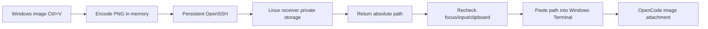

<p align="center">
  <b>English</b> ·
  <a href="README.zh-CN.md">简体中文</a>
</p>

<p align="center">
  
</p>

<p align="center">
  <a href="https://github.com/Empty-Jing/opencode-ssh-image-paste/releases/latest"></a>
  <a href="https://github.com/Empty-Jing/opencode-ssh-image-paste/actions/workflows/ci.yml"></a>
  <a href="LICENSE"></a>
</p>

<p align="center">
  <b>Paste Windows screenshots into a remote OpenCode session with the same Ctrl+V shortcut.</b><br>
  Text paste stays untouched. Image paste travels through your existing SSH connection.
</p>

<p align="center">
  <a href="#quick-start">Quick start</a> ·
  <a href="#features">Features</a> ·
  <a href="#how-it-works">How it works</a> ·
  <a href="#configuration">Configuration</a>
</p>

<p align="center">
  
  <br>
  <em>Capture → Ctrl+V → image appears in remote OpenCode.</em>
</p>

Regular SSH only transports terminal byte streams and cannot carry images from the Windows clipboard. This tool reads clipboard images locally on Windows, transfers them to a Linux receiver through a persistent OpenSSH subprocess, and pastes the resulting remote image path into OpenCode as regular text. OpenCode then recognizes the path as an image attachment.

## Quick Start

You need:

- Windows 10/11 and Windows Terminal.
- Windows OpenSSH Client.
- Linux OpenSSH Server.
- Non-interactive SSH key or `ssh-agent` authentication from Windows to Linux.
- An OpenCode model that supports image input.

### 1. Install

Open PowerShell on Windows and run:

```powershell
iwr https://github.com/Empty-Jing/opencode-ssh-image-paste/releases/latest/download/bootstrap.ps1 -OutFile bootstrap.ps1; .\bootstrap.ps1
```

Enter an SSH host or alias when prompted. The installer checks SSH, detects the
remote Linux architecture, downloads checksum-verified release binaries, deploys
the receiver, installs and starts the Windows client, enables startup at login,
and runs diagnostics.

For a non-interactive or auditable install, download the script first:

```powershell
iwr https://github.com/Empty-Jing/opencode-ssh-image-paste/releases/latest/download/bootstrap.ps1 -OutFile bootstrap.ps1
.\bootstrap.ps1 -SshTarget ubuntu-workbox
```

The SSH target must already accept host-key and key/`ssh-agent` authentication
without an interactive password prompt. Rust is not required for this install.

### 2. Paste

1. Connect from Windows Terminal to Linux over SSH and start OpenCode directly or inside Herdr.
2. Capture a screenshot with `Win+Shift+S`.
3. Return to the original Windows Terminal window and press `Ctrl+V`.
4. The OpenCode input should show `[Image 1]`.

Text clipboard content continues to be pasted directly by Windows Terminal and does not use the image channel.

### 3. Verify

Check an existing installation at any time:

```powershell
& "$env:LOCALAPPDATA\Programs\OpenCodeSSHImagePaste\opencode-ssh-image-paste.exe" doctor
```

`doctor` checks the configuration, OpenSSH client, Windows Terminal, SSH
connection, remote receiver version, and the background client process.

To update, run the same quick-install command again. It keeps the existing
configuration while replacing the local client and remote receiver.

## Features

- One `Ctrl+V` shortcut: text passes through unchanged, while image-only clipboard content uses the bridge.
- Persistent SSH: the hot path does not start PowerShell, SCP, or a new SSH process.
- Safe cancellation: automatic paste is cancelled if the user changes windows, tabs, panes, keyboard input, mouse focus, or clipboard content during upload.
- Private storage: the receiver directory uses `0700`, image files use `0600`, and files created by the receiver are removed after 24 hours.
- Bounded protocol: images are limited to 16 MiB and responses to 64 KiB.
- No additional credentials: authentication reuses OpenSSH configuration, host key verification, SSH keys, or `ssh-agent`.

See [`docs/design.md`](docs/design.md) for the complete architecture, protocol, state machine, and threat model.

## How It Works



## Troubleshooting

If installation stops at `Testing SSH connection`, first verify that the target
can connect without prompts:

```powershell
ssh -o BatchMode=yes -n -T ubuntu-workbox "printf ready"
```

The command must print `ready` and exit. If it does not, connect once with normal
`ssh ubuntu-workbox` to accept the host key and configure key or `ssh-agent`
authentication.

## Build and Install Manually

Building from source requires a stable Rust/Cargo toolchain with Rust 2024
edition support.

### Install the Linux Receiver

Run from the repository directory on Linux:

```bash
./install-linux.sh
test -x ~/.local/bin/opencode-ssh-image-paste
```

The receiver stores images in:

```text
~/.cache/opencode-ssh-image-paste/
```

### Build the Windows Client

Cross-compile on Linux:

```bash
cargo install cargo-xwin --locked
cargo xwin build --release --target x86_64-pc-windows-msvc
```

Output:

```text
target/x86_64-pc-windows-msvc/release/opencode-ssh-image-paste.exe
```

Alternatively, build on Windows with Rust and Visual Studio Build Tools installed:

```powershell
cargo build --release
```

### Configure SSH

Create a host entry with non-interactive authentication in `%USERPROFILE%\.ssh\config`:

```sshconfig
Host ubuntu-workbox
    HostName linux.example.com
    User developer
    IdentityFile ~/.ssh/id_ed25519
    ServerAliveInterval 15
    ServerAliveCountMax 3
```

Verify the receiver and authentication:

```powershell
ssh ubuntu-workbox "test -x ~/.local/bin/opencode-ssh-image-paste && echo ready"
```

The command must print `ready` without stopping for a password or host confirmation prompt.

### Install the Windows Client

Place the EXE and `install-windows.ps1` in the same directory:

```powershell
powershell -ExecutionPolicy Bypass -File .\install-windows.ps1 `
  -SshTarget ubuntu-workbox `
  -BinaryPath .\opencode-ssh-image-paste.exe
```

Installation paths:

```text
Program: %LOCALAPPDATA%\Programs\OpenCodeSSHImagePaste\opencode-ssh-image-paste.exe
Config:  %APPDATA%\OpenCodeSSHImagePaste\config.toml
Startup: current user's Startup folder
```

The installer does not overwrite an existing configuration.

## Configuration

See [`config.example.toml`](config.example.toml) for the default configuration. To use a separate SSH configuration file:

```toml
ssh_arguments = ["-F", "C:\\Users\\name\\.ssh\\config"]
```

To adjust the clipboard restoration delay:

```toml
restore_clipboard_delay_ms = 250
```

To adjust the SSH/receiver request timeout:

```toml
request_timeout_seconds = 15
```

## Known Limitations

- By default, interception is limited to Windows Terminal's `CASCADIA_HOSTING_WINDOW_CLASS`.
- Image detection supports the registered PNG format and `CF_DIBV5`; applications that only publish `CF_DIB` or `CF_BITMAP` do not trigger the bridge.
- Clipboard content containing both text and images is treated as text to preserve existing paste semantics.
- The Windows client runs as a windowless background process and currently has no tray menu or graphical status page. It remains visible in Windows Task Manager.
- An elevated Windows Terminal may reject input injection from a client running without elevation.

## Development

```bash
cargo fmt --check
cargo clippy --all-targets -- -D warnings
cargo test --locked
cargo check --tests --target x86_64-pc-windows-msvc
```

See [`CONTRIBUTING.md`](CONTRIBUTING.md) for contribution guidance and [`SECURITY.md`](SECURITY.md) for security reporting.

## License

[MIT](LICENSE)
