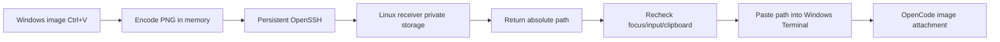

# OpenCode SSH Image Paste

English | [简体中文](README.zh-CN.md)

Paste screenshots from the Windows clipboard into an OpenCode TUI running on a remote Linux host over SSH. Text paste keeps its existing behavior; image paste uses the same `Ctrl+V` shortcut.

Supported workflow:

```text
Windows Terminal -> SSH -> Linux -> Herdr -> OpenCode TUI
```

Regular SSH only transports terminal byte streams and cannot carry images from the Windows clipboard. This tool reads clipboard images locally on Windows, transfers them to a Linux receiver through a persistent OpenSSH subprocess, and pastes the resulting remote image path into OpenCode as regular text. OpenCode then recognizes the path as an image attachment.

## Features

- One `Ctrl+V` shortcut: text passes through unchanged, while image-only clipboard content uses the bridge.
- Persistent SSH: the hot path does not start PowerShell, SCP, or a new SSH process.
- Safe cancellation: automatic paste is cancelled if the user changes windows, tabs, panes, keyboard input, mouse focus, or clipboard content during upload.
- Private storage: the receiver directory uses `0700`, image files use `0600`, and files created by the receiver are removed after 24 hours.
- Bounded protocol: images are limited to 16 MiB and responses to 64 KiB.
- No additional credentials: authentication reuses OpenSSH configuration, host key verification, SSH keys, or `ssh-agent`.

See [`docs/design.md`](docs/design.md) for the complete architecture, protocol, state machine, and threat model.

## How It Works



## Requirements

- Windows 10/11 and Windows Terminal.
- Windows OpenSSH Client.
- Linux OpenSSH Server.
- Non-interactive SSH key or `ssh-agent` authentication from Windows to Linux.
- An OpenCode model that supports image input.
- A stable Rust/Cargo toolchain with Rust 2024 edition support when building the receiver from source.

## Install the Linux Receiver

Run from the repository directory on Linux:

```bash
./install-linux.sh
test -x ~/.local/bin/opencode-ssh-image-paste
```

The receiver stores images in:

```text
~/.cache/opencode-ssh-image-paste/
```

## Build the Windows Client

Cross-compile on Linux:

```bash
cargo install cargo-xwin --locked
cargo xwin build --release --target x86_64-pc-windows-msvc
```

Output:

```text
target/x86_64-pc-windows-msvc/release/opencode-ssh-image-paste.exe
```

Alternatively, build on Windows with Rust and Visual Studio Build Tools installed:

```powershell
cargo build --release
```

## Configure SSH

Create a host entry with non-interactive authentication in `%USERPROFILE%\.ssh\config`:

```sshconfig
Host ubuntu-workbox
    HostName linux.example.com
    User developer
    IdentityFile ~/.ssh/id_ed25519
    ServerAliveInterval 15
    ServerAliveCountMax 3
```

Verify the receiver and authentication:

```powershell
ssh ubuntu-workbox "test -x ~/.local/bin/opencode-ssh-image-paste && echo ready"
```

The command must print `ready` without stopping for a password or host confirmation prompt.

## Install the Windows Client

Place the EXE and `install-windows.ps1` in the same directory:

```powershell
powershell -ExecutionPolicy Bypass -File .\install-windows.ps1 `
  -SshTarget ubuntu-workbox `
  -BinaryPath .\opencode-ssh-image-paste.exe
```

Installation paths:

```text
Program: %LOCALAPPDATA%\Programs\OpenCodeSSHImagePaste\opencode-ssh-image-paste.exe
Config:  %APPDATA%\OpenCodeSSHImagePaste\config.toml
Startup: current user's Startup folder
```

The installer does not overwrite an existing configuration.

## Usage

1. Connect from Windows Terminal to Linux over SSH and start OpenCode inside Herdr.
2. Capture a screenshot with `Win+Shift+S`.
3. Return to the original Windows Terminal window.
4. Press the usual `Ctrl+V` shortcut.
5. The OpenCode input should show `[Image 1]`.

Text clipboard content continues to be pasted directly by Windows Terminal and does not use the image channel.

## Configuration

See [`config.example.toml`](config.example.toml) for the default configuration. To use a separate SSH configuration file:

```toml
ssh_arguments = ["-F", "C:\\Users\\name\\.ssh\\config"]
```

To adjust the clipboard restoration delay:

```toml
restore_clipboard_delay_ms = 250
```

To adjust the SSH/receiver request timeout:

```toml
request_timeout_seconds = 15
```

## Known Limitations

- By default, interception is limited to Windows Terminal's `CASCADIA_HOSTING_WINDOW_CLASS`.
- Image detection supports the registered PNG format and `CF_DIBV5`; applications that only publish `CF_DIB` or `CF_BITMAP` do not trigger the bridge.
- Clipboard content containing both text and images is treated as text to preserve existing paste semantics.
- The Windows client is currently a minimized console application without a tray menu.
- An elevated Windows Terminal may reject input injection from a client running without elevation.

## Development

```bash
cargo fmt --check
cargo clippy --all-targets -- -D warnings
cargo test --locked
cargo check --tests --target x86_64-pc-windows-msvc
```

See [`CONTRIBUTING.md`](CONTRIBUTING.md) for contribution guidance and [`SECURITY.md`](SECURITY.md) for security reporting.

## License

[MIT](LICENSE)
