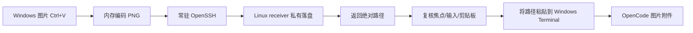

<p align="center">
  <a href="README.md">English</a> ·
  <b>简体中文</b>
</p>

<p align="center">
  
</p>

<p align="center">
  <a href="https://github.com/Empty-Jing/opencode-ssh-image-paste/releases/latest"></a>
  <a href="https://github.com/Empty-Jing/opencode-ssh-image-paste/actions/workflows/ci.yml"></a>
  <a href="LICENSE"></a>
</p>

<p align="center">
  <b>使用同一个 Ctrl+V，将 Windows 截图粘贴到远端 OpenCode。</b><br>
  文本照常粘贴，图片通过已有 SSH 配置传输。
</p>

<p align="center">
  <a href="#快速开始">快速开始</a> ·
  <a href="#特性">特性</a> ·
  <a href="#工作原理">工作原理</a> ·
  <a href="#配置">配置</a>
</p>

<p align="center">
  
  <br>
  <em>截图 → Ctrl+V → 图片出现在远端 OpenCode。</em>
</p>

普通 SSH 只传输终端字节流，不能携带 Windows 图片剪贴板。本工具在 Windows 本地读取图片，通过常驻 OpenSSH 子进程传到 Linux receiver，再把远端图片路径作为普通文本粘贴到 OpenCode。OpenCode 随后将该路径识别为图片附件。

## 快速开始

需要准备：

- Windows 10/11 和 Windows Terminal。
- Windows OpenSSH Client。
- Linux OpenSSH Server。
- Windows 到 Linux 已配置非交互 SSH key 或 `ssh-agent` 认证。
- OpenCode 使用支持图片输入的模型。

### 1. 安装

在 Windows PowerShell 中运行：

```powershell
iwr https://github.com/Empty-Jing/opencode-ssh-image-paste/releases/latest/download/bootstrap.ps1 -OutFile bootstrap.ps1; .\bootstrap.ps1
```

按提示输入 SSH 主机或别名。安装器会检测 SSH、识别远端 Linux 架构、下载并校验
Release 二进制、部署 Receiver、安装并启动 Windows Client、启用登录自启动，最后运行诊断。
一键安装不需要 Rust，但 SSH 必须已经配置好无需交互输入密码的密钥或 `ssh-agent` 认证。

如果希望先检查脚本再运行：

```powershell
iwr https://github.com/Empty-Jing/opencode-ssh-image-paste/releases/latest/download/bootstrap.ps1 -OutFile bootstrap.ps1
.\bootstrap.ps1 -SshTarget ubuntu-workbox
```

### 2. 粘贴图片

1. 从 Windows Terminal SSH 到 Linux，直接或通过 Herdr 启动 OpenCode。
2. 使用 `Win+Shift+S` 截图。
3. 回到原 Windows Terminal 窗口，按 `Ctrl+V`。
4. OpenCode 输入框应出现 `[Image 1]`。

文本剪贴板仍由 Windows Terminal 直接粘贴，不经过图片通道。

### 3. 验证

随时可以运行以下命令检查安装：

```powershell
& "$env:LOCALAPPDATA\Programs\OpenCodeSSHImagePaste\opencode-ssh-image-paste.exe" doctor
```

`doctor` 会检查配置、OpenSSH、Windows Terminal、SSH 连接、远端 Receiver 版本和后台 Client 进程。

更新时重新执行同一条快速安装命令即可。安装器会保留已有配置，并替换本地 Client
和远端 Receiver。

## 特性

- 同一个 `Ctrl+V`：文本原样放行，只有纯图片剪贴板内容才进入桥接。
- 常驻 SSH：热路径不启动 PowerShell、SCP 或新的 SSH 进程。
- 安全取消：上传期间切换窗口、Tab、pane、输入按键、改变鼠标焦点或复制新内容时，自动粘贴会被取消。
- 私有落盘：receiver 目录权限为 `0700`，图片文件权限为 `0600`，receiver 创建的文件会在 24 小时后清理。
- 有界协议：图片最大 16 MiB，响应最大 64 KiB。
- 无额外凭据：复用 OpenSSH 配置、主机密钥校验、SSH key 或 `ssh-agent`。

完整架构、协议、状态机和威胁模型参见 [`docs/design.md`](docs/design.md)。

## 工作原理



## 故障排查

如果安装停在 `Testing SSH connection`，先检查目标主机是否能在无提示的情况下连接：

```powershell
ssh -o BatchMode=yes -n -T ubuntu-workbox "printf ready"
```

命令必须输出 `ready` 并退出。否则请先用普通的 `ssh ubuntu-workbox` 连接一次，接受主机
密钥，并配置 SSH key 或 `ssh-agent` 认证。

## 手动构建与安装

从源码构建需要支持 Rust 2024 edition 的 Rust/Cargo stable 工具链。

### 安装 Linux Receiver

在 Linux 仓库目录执行：

```bash
./install-linux.sh
test -x ~/.local/bin/opencode-ssh-image-paste
```

Receiver 默认将图片保存到：

```text
~/.cache/opencode-ssh-image-paste/
```

### 构建 Windows Client

在 Linux 上交叉构建：

```bash
cargo install cargo-xwin --locked
cargo xwin build --release --target x86_64-pc-windows-msvc
```

产物：

```text
target/x86_64-pc-windows-msvc/release/opencode-ssh-image-paste.exe
```

也可在安装 Rust 和 Visual Studio Build Tools 的 Windows 主机执行：

```powershell
cargo build --release
```

### 配置 SSH

在 `%USERPROFILE%\.ssh\config` 中准备可免交互认证的 Host：

```sshconfig
Host ubuntu-workbox
    HostName linux.example.com
    User developer
    IdentityFile ~/.ssh/id_ed25519
    ServerAliveInterval 15
    ServerAliveCountMax 3
```

验证 receiver 和认证：

```powershell
ssh ubuntu-workbox "test -x ~/.local/bin/opencode-ssh-image-paste && echo ready"
```

命令必须输出 `ready`，不能停在密码或主机确认提示。

### 安装 Windows Client

把 EXE 和 `install-windows.ps1` 放在同一目录：

```powershell
powershell -ExecutionPolicy Bypass -File .\install-windows.ps1 `
  -SshTarget ubuntu-workbox `
  -BinaryPath .\opencode-ssh-image-paste.exe
```

安装位置：

```text
程序：%LOCALAPPDATA%\Programs\OpenCodeSSHImagePaste\opencode-ssh-image-paste.exe
配置：%APPDATA%\OpenCodeSSHImagePaste\config.toml
自启动：当前用户 Startup 文件夹
```

安装脚本不会覆盖已有配置。

## 配置

默认配置参见 [`config.example.toml`](config.example.toml)。指定独立 SSH 配置文件：

```toml
ssh_arguments = ["-F", "C:\\Users\\name\\.ssh\\config"]
```

调整剪贴板恢复等待时间：

```toml
restore_clipboard_delay_ms = 250
```

调整 SSH/receiver 请求超时：

```toml
request_timeout_seconds = 15
```

## 已知限制

- 默认只拦截 Windows Terminal 的 `CASCADIA_HOSTING_WINDOW_CLASS`。
- 图片检测支持注册格式 PNG 和 `CF_DIBV5`；只发布 `CF_DIB` 或 `CF_BITMAP` 的应用不会触发桥接。
- 同时包含文本与图片时按文本处理，避免改变原有粘贴语义。
- Windows client 以无窗口后台进程运行，当前没有托盘菜单或图形化状态页；它仍会正常显示在 Windows 任务管理器中。
- 提权 Windows Terminal 可能拒绝普通权限 client 的输入注入。

## 开发

```bash
cargo fmt --check
cargo clippy --all-targets -- -D warnings
cargo test --locked
cargo check --tests --target x86_64-pc-windows-msvc
```

贡献指南见 [`CONTRIBUTING.md`](CONTRIBUTING.md)，安全问题报告方式见 [`SECURITY.md`](SECURITY.md)。

## 许可证

[MIT](LICENSE)
