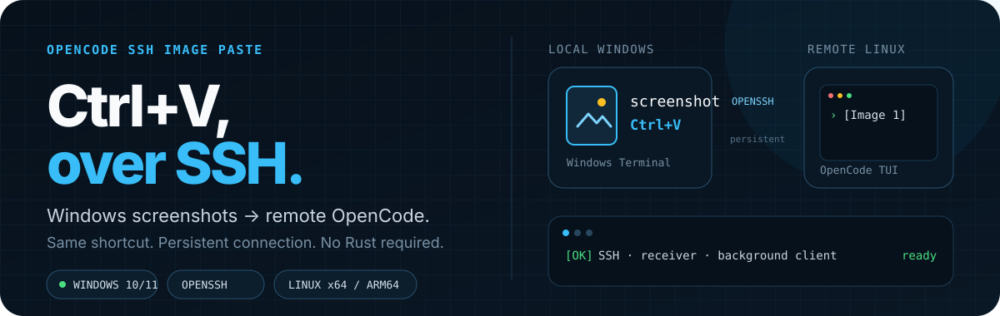
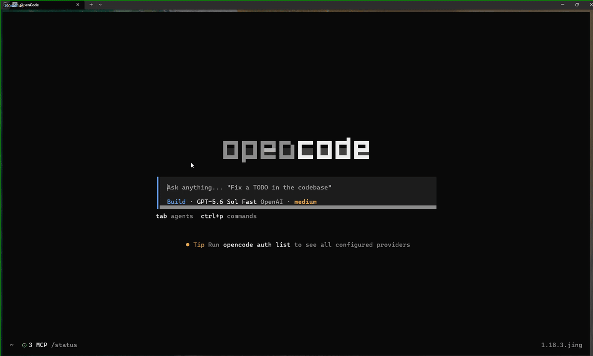
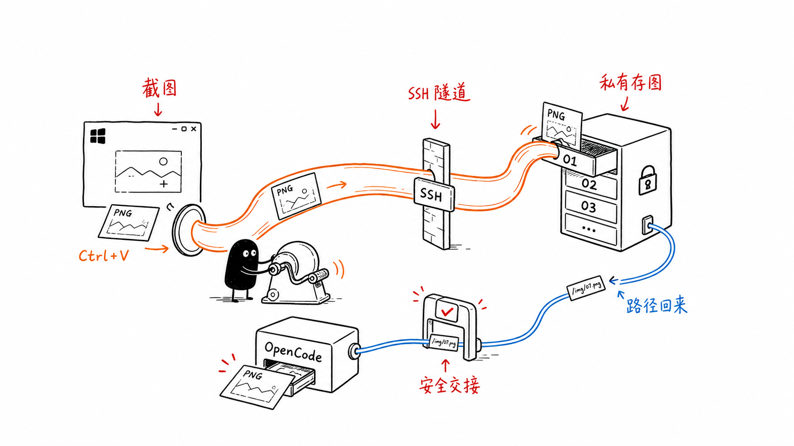

<p align="center">
  <a href="README.md">English</a> ·
  <b>简体中文</b>
</p>

<p align="center">
  
</p>

<p align="center">
  <a href="https://github.com/Empty-Jing/opencode-ssh-image-paste/releases/latest"></a>
  <a href="https://github.com/Empty-Jing/opencode-ssh-image-paste/actions/workflows/ci.yml"></a>
  <a href="LICENSE"></a>
</p>

<p align="center">
  <b>使用同一个 Ctrl+V，将 Windows 截图粘贴到远端 OpenCode。</b><br>
  文本照常粘贴，图片通过复用且验证专用证书的 HTTPS 连接传输。
</p>

<p align="center">
  <a href="#快速开始">快速开始</a> ·
  <a href="#特性">特性</a> ·
  <a href="#工作原理">工作原理</a> ·
  <a href="#故障排查">故障排查</a>
</p>

<p align="center">
  
  <br>
  <em>截图 → Ctrl+V → 图片出现在远端 OpenCode。</em>
</p>

普通终端 SSH 只传输字节流，不能携带 Windows 图片剪贴板。本工具在 Windows 本地读取图片并使用 Fast PNG 压缩，通过验证专用证书的 HTTPS 将 OCB2 帧传到常驻 Linux Receiver，再触发对应的私有 Windows Terminal `sendInput` Action，原子粘贴图片路径。SSH 保留用于安装和显式回退；HTTPS 认证、TLS 或网络失败后绝不会自动回退 SSH。

## 快速开始

需要准备：

- Windows 10/11 和 Windows Terminal。
- Windows OpenSSH Client。
- Linux OpenSSH Server；HTTPS 模式还要求可用的 `systemd --user` 和 `Linger=yes`。
- Windows 到 Linux 已配置非交互 SSH key 或 `ssh-agent` 认证，用于部署。
- Windows 可访问的固定内网主机名/IP 和端口；安装器不会自动修改防火墙。
- OpenCode 使用支持图片输入的模型。

### 1. 安装

在 Windows 中打开 PowerShell，然后运行：

```powershell
iwr https://github.com/Empty-Jing/opencode-ssh-image-paste/releases/latest/download/bootstrap.ps1 -OutFile bootstrap.ps1 -ErrorAction Stop
.\bootstrap.ps1
```

按提示输入 SSH 主机或别名，以及 Receiver 的固定内网主机名/IP。HTTPS 是默认传输，未传
`-HttpsPort` 时使用端口 `47832`。默认安装会创建当前用户的普通 Startup 快捷方式。安装器随后
检测 SSH、识别远端 Linux 架构、下载并校验 Release 二进制、部署 Receiver、安装并启动
Windows Client、启用登录自启动，最后运行诊断。
一键安装不需要 Rust，但 SSH 必须已经配置好无需交互输入密码的密钥或 `ssh-agent` 认证。

发布的 x86_64 和 aarch64 Linux Receiver 使用 musl 静态链接，不依赖远端发行版的
glibc 版本。

如果希望先检查脚本再运行：

```powershell
iwr https://github.com/Empty-Jing/opencode-ssh-image-paste/releases/latest/download/bootstrap.ps1 -OutFile bootstrap.ps1
.\bootstrap.ps1 -SshTarget ubuntu-workbox -HttpsHost 10.0.0.8 -HttpsPort 47832
```

无交互安装必须显式传入 `-SshTarget` 和 `-HttpsHost`。仅在明确回退到 SSH 上传时使用
`-LegacySshTransport`；省略 `-HttpsHost` 不再表示 SSH 模式：

```powershell
.\bootstrap.ps1 -SshTarget ubuntu-workbox -LegacySshTransport
```

默认普通权限 Client 无法向管理员 Windows Terminal 注入输入。如果确实需要支持管理员
Terminal，请从管理员 PowerShell 显式启用最高权限登录计划任务：

```powershell
.\bootstrap.ps1 -SshTarget ubuntu-workbox -ElevatedStartup
```

提权模式会信任当前用户可写目录中的 Client、启动器和配置，只应在确实需要支持管理员
Terminal 时使用。旧命令中的 `-NonElevatedStartup` 参数仍兼容，但默认模式下不再需要。

### 2. 粘贴图片

1. 从 Windows Terminal SSH 到 Linux，直接或通过 Herdr 启动 OpenCode。
2. 使用 `Win+Shift+S` 截图。
3. 回到原 Windows Terminal 窗口，按 `Ctrl+V`。
4. OpenCode 输入框应出现 `[Image 1]`。

文本剪贴板仍由 Windows Terminal 直接粘贴，不经过图片通道。

### 3. 验证

随时可以运行以下命令检查安装：

```powershell
& "$env:LOCALAPPDATA\Programs\OpenCodeSSHImagePaste\opencode-ssh-image-paste.exe" doctor
```

`doctor` 会检查配置、专用 HTTPS 证书、带 Bearer 认证的能力端点、Windows Terminal 私有粘贴 Action、保留的 OpenSSH 安装/回退诊断和后台 Client 进程，且不会输出 Token。

更新时重新执行同一条快速安装命令即可。安装器会保留已有配置，并替换本地 Client 和远端
Receiver。已有提权安装切回默认普通模式时，需要从管理员 PowerShell 执行一次，以删除旧计划任务。

### 4. 卸载

删除 Windows Client、普通或提权登录启动项、配置、远端 Receiver 和远端图片缓存：

```powershell
.\bootstrap.ps1 -Uninstall
```

添加 `-KeepConfig` 可以保留本地配置。如果配置已经丢失，请使用
`-SshTarget ubuntu-workbox` 显式指定远端。显式启用过提权计划任务的安装需要从管理员
PowerShell 执行卸载。

## 特性

- 只拦截精确的 `Ctrl+V`：文本以及 `Ctrl+Shift+V` 等带额外修饰键的组合原样放行，只有纯图片剪贴板内容才进入桥接。
- 原子终端交接：bootstrap 增加 10 个私有槽位 Action，不替换 Windows Terminal 原有的 `Ctrl+V` 绑定。
- 复用 HTTPS：长期存活的 `ureq::Agent` 复用 TLS 连接池；认证、TLS 或网络失败不会触发 SSH 回退。
- 安全取消：上传期间切换窗口、Tab、pane、输入按键、改变鼠标焦点或复制新内容时，自动粘贴会被取消。
- 有界私有历史：每次只上传当前粘贴的一张图片；receiver 目录权限为 `0700`，以权限为 `0600` 的图片槽位保留最近 10 次成功粘贴；第 11 次成功粘贴覆盖最旧槽位。
- 有界协议：编码后的图片最大 16 MiB；标准解码完成后校验边长、像素数和 RGBA 大小；响应最大 64 KiB。
- 专用信任：bootstrap 生成 SAN 覆盖 `-HttpsHost` 的自签名证书，并将它作为该连接唯一的信任根；同时生成至少 32 随机字节的 Bearer Token，Token 不进入命令行。

完整架构、协议、状态机和威胁模型参见 [`docs/design.md`](docs/design.md)。

## 工作原理

<p align="center">
  
</p>

1. **读取：** 按下 `Ctrl+V` 后，在 Windows 本地读取图片并在内存中编码为 PNG。
2. **传输：** 可复用 HTTPS Agent 将 OCB2 PNG 帧传到用户级 systemd Receiver；Receiver 写入 10 个私有槽位之一，并以 OCR2 返回准确路径。
3. **交接：** 焦点、输入和剪贴板安全检查通过后，Windows Terminal 将该路径原子发送给 OpenCode。

返回 Windows 的只有一小段路径，原始图片剪贴板不会被替换。

## 故障排查

如果安装停在 `Testing SSH connection`，先检查目标主机是否能在无提示的情况下连接：

```powershell
ssh -o BatchMode=yes -n -T ubuntu-workbox "printf ready"
```

命令必须输出 `ready` 并退出。否则请先用普通的 `ssh ubuntu-workbox` 连接一次，接受主机
密钥，并配置 SSH key 或 `ssh-agent` 认证。

下载失败、旧后台进程、任务栏窗口、图片粘贴失败、Receiver 检查和完整卸载说明参见
[故障排查指南](docs/troubleshooting.zh-CN.md)。

## 手动构建与安装

从源码构建需要 Rust/Cargo 1.89 或更高版本，并支持 Rust 2024 edition。

### 安装 Linux Receiver

在 Linux 仓库目录执行：

```bash
./install-linux.sh
test -x ~/.local/bin/opencode-ssh-image-paste
```

Receiver 默认将图片保存到：

```text
~/.cache/opencode-ssh-image-paste/
```

### 构建 Windows Client

在 Linux 上交叉构建：

```bash
cargo install cargo-xwin --locked
cargo xwin build --release --target x86_64-pc-windows-msvc
```

产物：

```text
target/x86_64-pc-windows-msvc/release/opencode-ssh-image-paste.exe
```

也可在安装 Rust 和 Visual Studio Build Tools 的 Windows 主机执行：

```powershell
cargo build --release
```

### 配置 SSH

在 `%USERPROFILE%\.ssh\config` 中准备可免交互认证的 Host：

```sshconfig
Host ubuntu-workbox
    HostName linux.example.com
    User developer
    IdentityFile ~/.ssh/id_ed25519
    ServerAliveInterval 15
    ServerAliveCountMax 3
```

验证 receiver 和认证：

```powershell
ssh ubuntu-workbox "test -x ~/.local/bin/opencode-ssh-image-paste && echo ready"
```

命令必须输出 `ready`，不能停在密码或主机确认提示。

### 安装 Windows Client

把 `bootstrap.ps1` 和 `install-windows.ps1` 放在同一目录，并提供从同一个
commit 构建的 Windows client 与 Linux receiver 二进制：

```powershell
powershell -ExecutionPolicy Bypass -File .\install-windows.ps1 `
  -SshTarget ubuntu-workbox `
  -HttpsHost 10.0.0.8 `
  -HttpsPort 47832 `
  -WindowsBinaryPath .\target\x86_64-pc-windows-msvc\release\opencode-ssh-image-paste.exe `
  -LinuxBinaryPath .\target\release\opencode-ssh-image-paste
```

安装位置：

```text
程序：%LOCALAPPDATA%\Programs\OpenCodeSSHImagePaste\opencode-ssh-image-paste.exe
配置：%APPDATA%\OpenCodeSSHImagePaste\config.toml
自启动：当前用户 Startup 文件夹，或显式启用的提权登录任务
```

安装脚本会调用 `bootstrap.ps1`，只更新已有配置中的 SSH 目标和远端粘贴目录，
保留其他设置，并安装用于原子粘贴图片路径的 10 个 Windows Terminal 私有 `sendInput` 槽位 Action。

## 配置

配置参见 [`config.example.toml`](config.example.toml)。缺少 `transport` 的旧配置仍默认使用 SSH；HTTPS bootstrap 成功后会写入 `transport = "https"`、Endpoint、生成的 Token 和专用证书路径。只有显式回退时才设置 `transport = "ssh"`，并应先停止 HTTPS 服务。指定独立 SSH 配置文件：

```toml
ssh_arguments = ["-F", "C:\\Users\\name\\.ssh\\config"]
```

调整 SSH/receiver 请求超时：

```toml
request_timeout_seconds = 15
```

自动安装使用 Receiver 的默认图片目录。如果现有 `remote_command` 是自定义命令
（例如包含 `--dir`），安装器会在改动系统前明确拒绝，避免 Terminal Action 与实际
上传目录不一致。自定义 Receiver 命令需要手工同步配置 Client 和 Terminal Action。

## 已知限制

- 默认只拦截 Windows Terminal 的 `CASCADIA_HOSTING_WINDOW_CLASS`。
- Hook 无法按 SSH 主机区分 Tab；在任意 Windows Terminal Tab 中执行图片 `Ctrl+V`，都会上传到该 client 配置的唯一 SSH 目标。
- 图片检测支持注册格式 PNG、`CF_DIBV5`、`CF_DIB` 和 `CF_BITMAP`；应用私有格式只有在 Windows 能将其合成为标准 Bitmap 时才可使用。
- 标准 PNG/DIBV5 解码器可能在结果校验前分配内存，因此这些校验不是解码峰值内存的硬上限；协议和 receiver 仍会在分配前校验帧长度。
- 同时包含文本与图片时按文本处理，避免改变原有粘贴语义。
- 远端 10 个活动槽位会保留图片直到被覆盖或卸载；按每张 16 MiB 的协议上限计算，最坏约占 160 MiB，普通截图通常远小于该值。从旧 50 槽布局升级后，退出使用的旧槽可能继续保留最多 24 小时，清理前会暂时维持原有的较高磁盘占用。
- Windows client 以无窗口后台进程运行，当前没有托盘菜单或图形化状态页；它仍会正常显示在 Windows 任务管理器中。
- 提权 Windows Terminal 可能拒绝普通权限 client 的输入注入。
- HTTPS Receiver 使用 Axum，设置10秒TLS握手超时、覆盖异步请求体收集和Receiver锁等待的15秒超时、16请求并发上限和请求体硬边界。已经开始的原子文件存储是同步操作，不会被该超时抢占。它仍是单用户内网服务，即使启用了TLS和Bearer认证，也不得暴露到公网。

## 文档

| 文档 | 内容 |
| --- | --- |
| [故障排查](docs/troubleshooting.zh-CN.md) | SSH 卡住、安装失败、后台进程、粘贴失败和卸载 |
| [设计说明](docs/design.md) | 架构、协议、状态机和威胁模型 |
| [更新日志](CHANGELOG.md) | Release 历史和未发布变更 |
| [配置示例](config.example.toml) | 支持的设置与默认值 |
| [安全策略](SECURITY.md) | 安全问题报告方式 |

## 开发

```bash
cargo fmt --check
cargo clippy --all-targets -- -D warnings
cargo test --locked
cargo check --tests --target x86_64-pc-windows-msvc
pwsh -NoProfile -File ./tests/bootstrap.Tests.ps1
```

贡献指南见 [`CONTRIBUTING.md`](CONTRIBUTING.md)，安全问题报告方式见 [`SECURITY.md`](SECURITY.md)。

## 许可证

[MIT](LICENSE)
