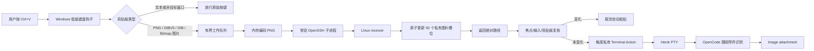
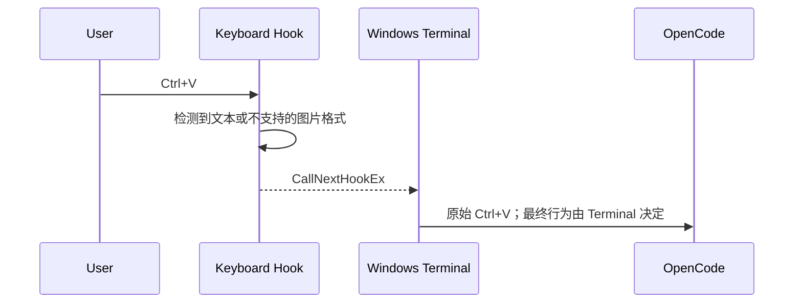
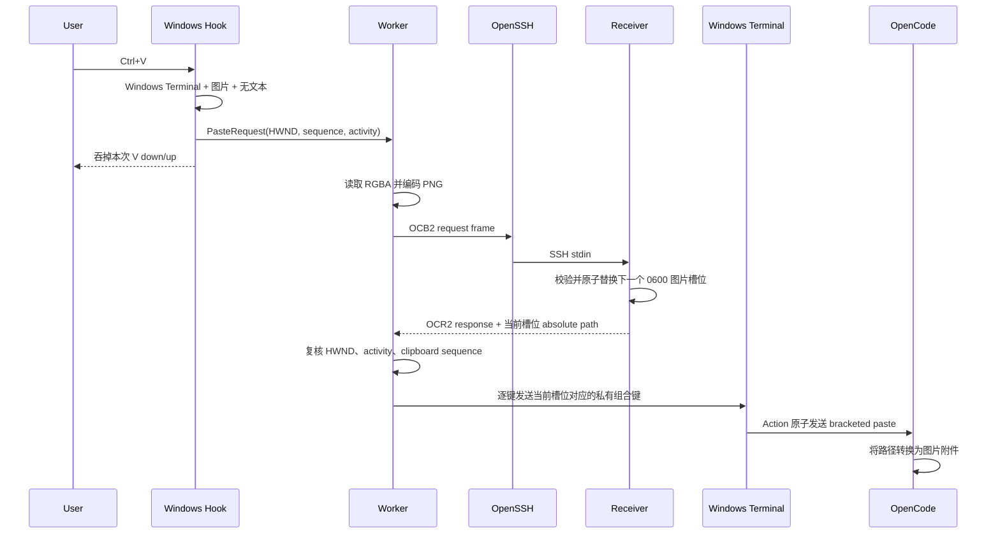
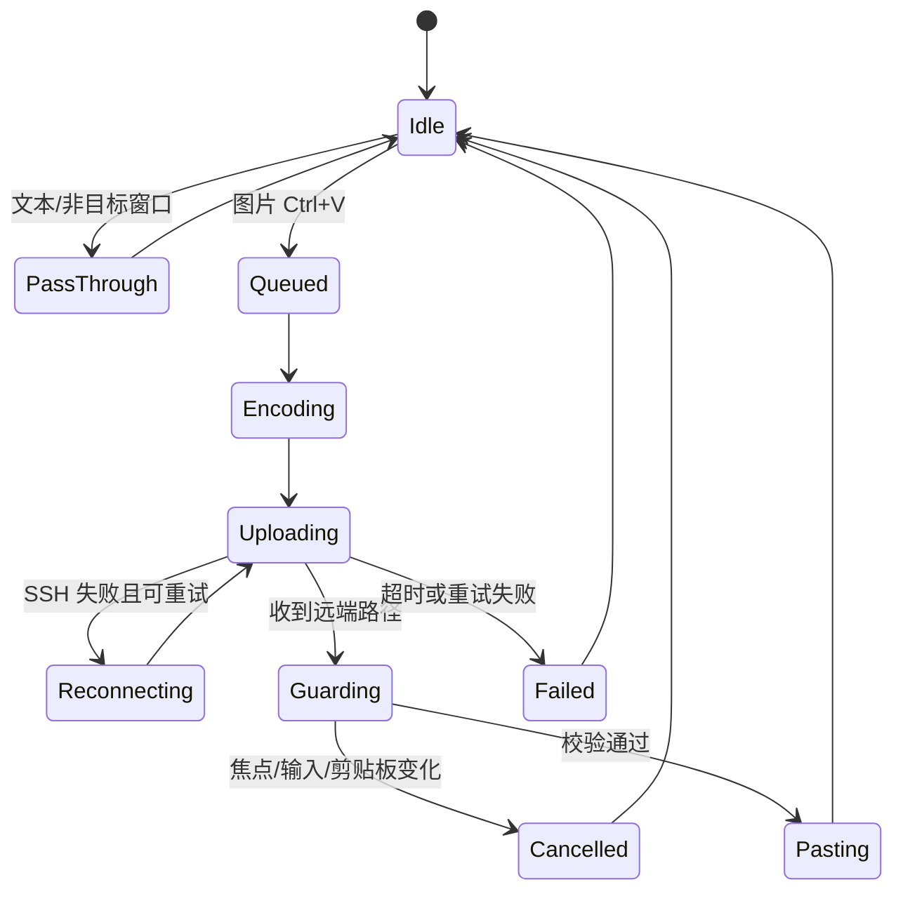
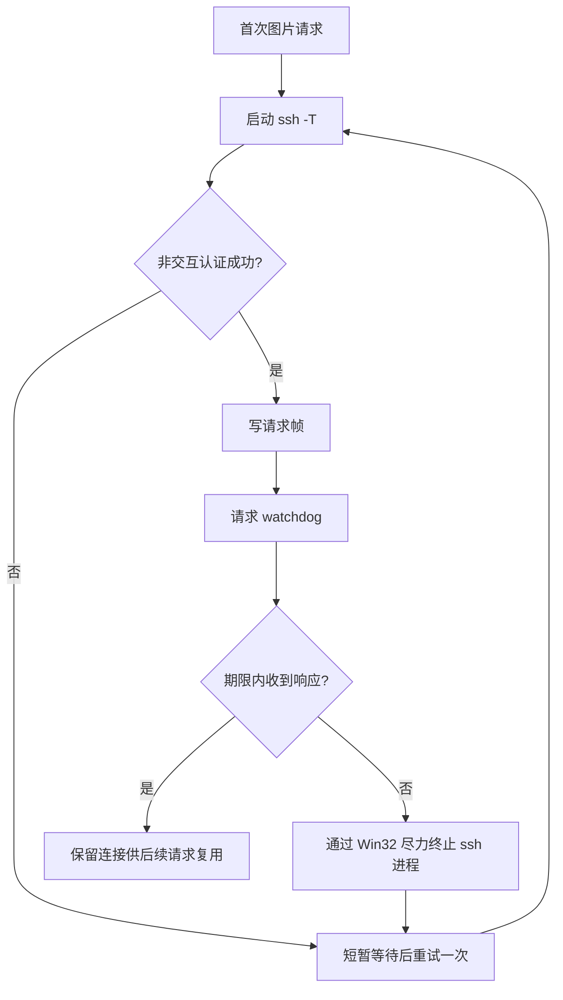

# OpenCode SSH Image Paste 设计文档

## 1. 文档目的

本文说明 OpenCode SSH Image Paste 的问题背景、系统边界、架构、协议、关键状态机、安全策略和验证要求。目标读者是维护者、贡献者和准备评估该工具的终端用户。

## 2. 问题与目标

典型工作流为 Windows Terminal 通过普通 SSH 连接 Linux，在 Herdr pane 中运行 OpenCode TUI。普通 SSH 只传递终端字节流，Windows Terminal 能把文本剪贴板转换为字符，却不会把图片剪贴板编码后传给远端，因此图片 `Ctrl+V` 在 OpenCode 中完全没有反应。

本项目保留原有工作习惯：

- 文本剪贴板继续由 Windows Terminal 处理，`Ctrl+V` 行为不变；
- 图片剪贴板使用同一个 `Ctrl+V`；
- 图片通过常驻 SSH 通道传到 Linux，不为每次粘贴启动 PowerShell、SCP 或新 SSH；
- Linux 原子更新 50 个私有图片槽位中的下一个槽位，Windows 触发对应的 Terminal `sendInput` Action，一次性发送 bracketed paste，OpenCode 将该路径转成图片附件；
- 用户在上传期间切换窗口、Tab、pane、输入按键、点击鼠标或复制新内容时，自动粘贴必须取消。

## 3. 非目标

- 不修改 SSH 协议、Herdr 或 OpenCode；只由安装器添加 50 个隐藏的 Windows Terminal 槽位 Action；
- 不同步完整的 Windows/Linux 剪贴板历史；
- 不提供文件管理、远程桌面或通用剪贴板共享；
- 不绕过 OpenSSH 主机校验、认证或操作系统权限；
- 不保证所有 Windows 应用发布的图片剪贴板格式都可读取。

## 4. 总体架构



项目发布一个二进制，按子命令承担两种角色：

| 模式 | 平台 | 职责 |
|---|---|---|
| `client` | Windows | 监听图片粘贴、编码 PNG、维护 SSH、保护焦点与剪贴板、触发 Terminal Action |
| `receiver` | Linux | 读取帧、校验边界、原子更新固定私有图片、返回路径、清理旧文件 |

## 5. 模块设计

### 5.1 `main.rs`

负责轻量命令分发。Windows 默认进入 `client`，Linux 使用 `receiver [--dir PATH]`；`receiver --print-directory` 输出 50 个 Action 共用的绝对图片目录，`receiver --capabilities` 输出安装器和 doctor 校验的协议能力。Linux 上主动启动 client 会返回明确错误。

### 5.2 `windows.rs`

Windows client 启动时先获取当前用户会话内的命名 Mutex，重复实例会明确退出。Windows 端随后由四个逻辑部分组成：

1. 低级键盘和鼠标钩子只做快速判断、活动计数和入队，不执行阻塞工作。
2. 单工作线程读取剪贴板、编码 PNG，并串行处理上传，避免多个请求争抢剪贴板。
3. `Transport` 维护一个 OpenSSH 子进程，通过 stdin/stdout 复用连接，并通过 watchdog 处理阻塞。
4. 前台窗口、剪贴板序号和用户活动代次共同防止错误注入；上传成功后根据 receiver 返回的槽位，通过对应的私有 F11-F24 组合键触发 Windows Terminal Action。

### 5.3 `protocol.rs`

协议使用 `OCB2`/`OCR2` 固定长度头和原始 PNG 字节，避免 Base64 膨胀和 shell 转义。所有长度在分配内存前校验；版本 2 明确表示 receiver 返回 50 槽位中的绝对路径，旧协议会直接拒绝而不会静默混用。

### 5.4 `receiver.rs`

Receiver 在同一 SSH 进程中循环处理请求，并在进程生命周期内持有图片目录的独占文件锁，避免重复 client 或重叠 SSH 连接分配到同一槽位。每次请求只携带当前粘贴的一张图片。目录创建后设置为 `0700`；最多维护 50 个 `image-00.png` 到 `image-49.png` 槽位，每次先通过 `create_new` 写入 `0600` 临时文件，再用同目录原子 rename 替换当前槽位，保证 OpenCode 不会读取半张图片。写入失败会立即清理临时文件；managed slot 若不是普通文件则拒绝启动。第 51 次成功粘贴开始循环覆盖最旧槽位。清理任务只删除旧版 `clipboard-*.png` 和遗留临时文件。

## 6. 关键流程

### 6.1 文本粘贴



该流程不经过 SSH bridge worker，确保工具未运行或异常时，原有文本粘贴仍然可用。

### 6.2 图片粘贴



## 7. Client 状态机



## 8. 二进制协议

### 8.1 请求帧

```text
4 bytes  magic       "OCB2"
8 bytes  request_id  big-endian u64
4 bytes  png_length  big-endian u32
N bytes  png_data
```

### 8.2 响应帧

```text
4 bytes  magic          "OCR2"
8 bytes  request_id     big-endian u64
1 byte   status         0=success, 1=error
4 bytes  message_length big-endian u32
N bytes  UTF-8 path or error
```

协议上限：图片 16 MiB，响应消息 64 KiB。帧内没有协商过程；安装器和 doctor 通过 `receiver --capabilities` 要求精确匹配 `protocol=2;image_slots=50;response=slot-path-v1`。任何破坏兼容性的修改都必须升级 magic/version 和能力串并保留清晰错误。

## 9. 剪贴板与焦点安全

### 9.1 条件拦截

只有以下条件全部成立时才吞掉 `Ctrl+V`：

- 前台窗口 class 为配置的 Windows Terminal class；
- 按键为精确的 `Ctrl+V`，没有同时按下 Shift、Alt 或 Win；
- 剪贴板没有 `CF_UNICODETEXT`；
- 剪贴板提供注册格式 PNG、`CF_DIBV5`、`CF_DIB` 或 `CF_BITMAP`；
- 有界队列能够接受请求。

混合文本与图片的剪贴板优先保留文本语义。

### 9.2 防误粘贴

请求记录触发时的顶层 HWND、clipboard sequence 和用户活动代次。实现监控到的非拦截 key-down 和指定鼠标点击/滚轮事件会推进活动代次，因此即使 Windows Terminal 内部切换 Tab 或 Herdr pane、顶层 HWND 没变，最终检查仍会取消粘贴。没有输入事件的程序化切换不在该保证范围内。

### 9.3 Windows Terminal 原子输入

输出端不清空、替换或恢复 Windows 剪贴板。`bootstrap.ps1` 查询 Receiver 的绝对图片目录，并向用户的 Windows Terminal `settings.json` 添加 50 个隐藏的 `sendInput` 槽位 Action。每个 Action 持有完整的 `ESC [ 200 ~ + image-NN.png + ESC [ 201 ~`，由 Windows Terminal 一次性写入 PTY，避免逐字符 `SendInput` 被 TUI 的按键解析器拆分并留下可见 `0~`。Client 根据 Receiver 返回的槽位只模拟对应内部组合键；普通文本 `Ctrl+V` 配置不变。`doctor` 同时检查全部 50 个 Action ID 与路径，升级和卸载只替换或删除项目自己的标记块。该方案要求 client 与目标 Terminal 处于相同完整性级别。

## 10. SSH 生命周期



客户端强制启用 `BatchMode=yes`，要求使用 SSH key 或 `ssh-agent`。Windows client 使用 `CREATE_NO_WINDOW` 启动 OpenSSH 子进程，避免无窗口 client 首次粘贴时由 `ssh.exe` 创建控制台并抢走前台焦点。连接、写入或响应失败时，当前请求最多重连并重传一次；第二次失败后结束当前请求，下一次图片粘贴再建立新连接。OpenSSH 负责加密、主机密钥校验和身份认证；本工具不实现自有加密或凭据存储。

## 11. 威胁模型

| 风险 | 控制措施 |
|---|---|
| 恶意或损坏的长度字段 | 分配前校验 16 MiB/64 KiB 上限 |
| 超大或损坏的剪贴板图片 | client 校验解码结果的边长、像素数和 RGBA 大小；标准解码器仍可能在校验前分配，残余风险为 client 内存耗尽 |
| 非图片 payload | Receiver 校验 PNG 签名 |
| 路径覆盖或符号链接攻击 | `0700` 私有目录、`create_new` 临时文件、同目录原子 rename |
| 临时图片泄露 | 50 个有界图片槽位与临时文件均为 `0600`，遗留临时文件定期清理 |
| 上传后切换目标导致误注入 | HWND、活动代次、剪贴板 sequence 三重检查 |
| 覆盖用户新剪贴板 | 输出路径不写入系统剪贴板，原图片始终保留 |
| SSH 半连接或 receiver 卡死 | OpenSSH keepalive、连接超时、请求 watchdog |
| 输入注入 | 图片走二进制 stdin；安装时验证绝对路径，Terminal Action 固定原子发送 bracketed paste |

## 12. 已知限制

- Windows client 当前只支持 Windows Terminal 的窗口 class，可通过配置覆盖，但其他终端未验证。
- 图片检测与读取支持注册格式 PNG、`CF_DIBV5`、`CF_DIB` 和 `CF_BITMAP`。标准解码失败时，Windows GDI 会把 DIB/Bitmap 转为 32 位 RGBA；应用私有格式（例如 `PixPinData`）不参与解析。
- 注册 PNG/DIBV5 由标准依赖库复制并解码，可能在 client 校验尺寸前分配内存；当前上限约束可接受的解码结果，不构成解码阶段峰值内存的硬上限。协议和 receiver 的帧长度仍在分配前校验。
- 同时包含文本与图片格式时优先文本，避免破坏原文本 `Ctrl+V`。
- Windows client 保持 console 子系统以便 `doctor` 输出诊断；安装器通过 `wscript.exe` 隐藏启动器以窗口样式 `0` 启动 client，client 进入后台后立即分离 console，因此不会在登录时闪现控制台，也不保留控制台或任务栏窗口。默认按当前用户注册 `RunLevel=Highest` 的登录计划任务，以匹配管理员 Windows Terminal；`-NonElevatedStartup` 才改用普通 Startup 快捷方式。当前没有托盘菜单和图形化状态页，进程仍会正常显示在 Windows 任务管理器中。
- 自动安装只支持默认 `remote_command` 和默认 Receiver 图片目录；带 `--dir` 等自定义 Receiver 命令必须手工同步 Client 的 `terminal_paste_directory` 与 50 个 Terminal Action。
- 自动粘贴依赖目标 Terminal 与 client 处于相同完整性级别；默认提权任务服务管理员 Terminal，显式非提权模式只服务普通 Terminal。
- 安装器需要修改 Windows Terminal `settings.json`；首次运行 Terminal 前没有该文件时，bootstrap 会要求先打开一次 Terminal。
- Linux receiver 已自动化测试；真实 Windows 输入、剪贴板和 Windows Terminal 行为仍需在发布前执行手工兼容性矩阵。
- Watchdog 通过 Win32 `TerminateProcess` 尽力中止超时 SSH；操作系统拒绝进程访问时无法形成严格超时保证。
- 最多 50 个图片槽位会保留到后续循环覆盖或卸载；第 51 次成功粘贴覆盖最旧槽位，旧版随机图片和遗留临时文件超过 24 小时后清理。

## 13. 验证策略

### 13.1 自动验证

```bash
cargo fmt --check
cargo clippy --all-targets -- -D warnings
cargo test --locked
cargo check --tests --target x86_64-pc-windows-msvc
cargo xwin build --release --target x86_64-pc-windows-msvc
```

### 13.2 Windows 手工矩阵

至少覆盖：

- 纯文本 `Ctrl+V`；
- `Win+Shift+S` 截图后图片 `Ctrl+V`；
- 连续粘贴多张图；
- 上传期间键盘切 Tab、Herdr pane；
- 上传期间鼠标点击其他 pane；
- 上传期间复制新文本；
- SSH 首次连接、断线、receiver 退出和请求超时；
- 超过 16 MiB 图片；
- 普通与提权 Windows Terminal；
- OpenCode 使用支持图片输入和不支持图片输入的模型。

## 14. 后续演进

1. 增加 Windows 托盘状态和非阻塞通知。
2. 增加真实 Windows 集成测试和 Windows Terminal 版本矩阵。
3. 继续扩充第三方截图软件的剪贴板兼容性矩阵。
4. 为协议增加显式能力协商和版本错误。
5. 评估向 Herdr 上游贡献 Windows clipboard image bridge，减少独立工具维护面。
