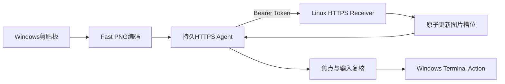

# HTTPS 直连与 Fast PNG 上传设计

## 1. 目标

将 Windows Client 到 Linux Receiver 的正常图片上传热路径从常驻 SSH 子进程改为内网 HTTPS 直连，并使用静态 Bearer Token 认证和 Fast PNG 编码。目标是在连接复用、内网吞吐正常时，将典型 2 至 3 MiB 图片的 `bridge_total_ms` 降至 500 ms 以内。

本变更只进入测试分支，不创建 Release、不修改版本、不打 Tag。

## 2. 已确认约束

- Windows Client 与 Linux Receiver 可以通过内网地址和固定端口直连。
- Linux Receiver 使用用户级 systemd 服务常驻；安装前必须确认 `systemctl --user` 可用且该用户已启用 linger。
- HTTPS 为正常上传热路径；SSH仅用于安装、诊断和显式回退。
- 不在 HTTPS 认证、TLS 或网络失败后自动降级到 SSH。
- 保留现有10个图片槽位、16 MiB图片上限、64 KiB响应上限、原子落盘和Terminal Action机制。
- 保留焦点、剪贴板序号和用户活动防误粘贴检查。
- Token不得进入日志、URL或进程命令行。

## 3. 总体流程



说明：Windows Client在进程生命周期内复用一个HTTPS Agent及其连接池。Receiver作为用户级systemd服务独立于SSH会话常驻。

## 4. 模块与 Seam

### 4.1 Transport seam

Windows侧保留一个统一图片上传Interface：

```text
upload(request_id, png, timeout, timing) -> remote_path
```

提供两个Adapter：

- `HttpsTransport`：默认热路径，持有长期复用的HTTPS Agent；
- `SshTransport`：保留现有实现，仅供显式配置回退。

配置缺少`transport`时默认`ssh`，保证旧配置兼容；bootstrap只有在HTTPS Receiver部署并探测成功后才写入`transport = "https"`。

### 4.2 Receiver state seam

Receiver存储状态集中管理：

- 持有目录锁；
- 初始化并推进下一个槽位；
- 调用现有PNG签名校验、临时文件写入和原子rename；
- stdio Receiver与HTTPS Receiver复用同一存储Interface。

HTTPS服务和stdio Receiver不能同时占用同一目录。显式切回SSH上传前必须先停止HTTPS服务。

### 4.3 Linux HTTPS Adapter

Linux HTTPS Adapter使用Axum 0.8、axum-server 0.8与rustls 0.23，并通过显式`ServerConfig`选择ring Provider，不依赖进程全局CryptoProvider。外部`serve(config_path)`Interface、CLI、TOML和OCB2/OCR2保持不变，Tokio运行时、TLS acceptor、Router和并发状态全部封装在`src/https_receiver.rs`内部。

所有Method和Path由同一个fallback Handler接收，避免框架在Bearer认证前自动返回404或405。Adapter先执行认证与协议预检，再申请16请求并发许可；TLS握手超时为10秒，异步请求体收集与Receiver锁等待的超时为15秒。声明长度、chunked和未知长度请求均通过有界body收集执行`MAX_IMAGE_BYTES + 16`硬限制。共享`ReceiverState`通过异步互斥串行调用存储Interface，防止同进程请求竞争槽位；已经开始的同步原子文件存储不受异步超时抢占。

## 5. HTTPS Interface

### 5.1 Endpoint

- `GET /v1/capabilities`
- `POST /v1/upload`

两个Endpoint都要求：

```text
Authorization: Bearer <token>
```

上传请求：

```text
Content-Type: application/octet-stream
Body: OCB2 request frame
```

上传响应：

```text
HTTP 200
Content-Type: application/octet-stream
Body: OCR2 response frame
```

继续复用现有OCB2/OCR2帧，避免JSON/Base64膨胀。HTTP层额外执行Method、Path、认证、Content-Type和Body上限检查。

### 5.2 状态码

- `200`：能力查询或已形成OCR2业务响应；
- `401`：Token缺失、重复或错误；
- `404`：未知Path；
- `405`：Method错误；
- `413`：请求体超过协议上限；
- `415`：Content-Type错误；
- `408`：异步请求体收集或Receiver锁等待超过15秒；已经开始的同步原子文件存储不被该超时中断；
- `503`：已达到16个并发请求上限。

Receiver业务错误仍通过HTTP 200内的OCR2 error返回，保持现有客户端语义。

## 6. TLS与Token

- 安装阶段生成仅供该Receiver使用的自签名证书和私钥；证书SAN必须覆盖Windows实际连接使用的主机名或IP。
- Windows Client保存公开证书并作为该HTTPS连接的专用信任根，不关闭证书验证。
- Token使用至少32个随机字节，编码为固定长度文本。
- Linux Receiver配置、私钥和Token权限为`0600`，配置目录为`0700`。
- Windows Token保存在现有用户级APPDATA配置中，不输出到doctor详情或timing log。
- 重定向必须禁用，防止Authorization Header被发送到其他Origin。

## 7. Receiver生命周期

安装器通过SSH完成首次部署，创建：

```text
~/.config/opencode-ssh-image-paste/receiver.toml
~/.config/opencode-ssh-image-paste/receiver-cert.pem
~/.config/opencode-ssh-image-paste/receiver-key.pem
~/.config/systemd/user/opencode-ssh-image-paste.service
```

服务行为：

```text
ExecStart=%h/.local/bin/opencode-ssh-image-paste receiver --https-config %h/.config/opencode-ssh-image-paste/receiver.toml
Restart=on-failure
```

安装前置条件：

- `systemctl --user`可用；
- `loginctl show-user`显示`Linger=yes`；
- 指定内网Endpoint可解析；
- 端口配置合法。

升级时必须原子替换二进制和配置、重启服务、通过带Token的HTTPS能力探测后再启动Windows Client。失败时恢复旧二进制、服务文件、Receiver配置、证书、Token和原运行状态。回滚不完整时不得启动旧Client。

卸载时停止并disable服务，删除项目自己的unit、Receiver配置、证书、私钥和Token，再删除远端二进制与缓存。远端清理失败时本地卸载可继续，但必须给出明确警告。

## 8. Fast PNG

对需要重新编码的RGBA图片设置：

```rust
encoder.set_compression(png::Compression::Fast);
```

保留RGBA、8-bit和16 MiB有界Writer。测试验证Fast输出可解码且像素一致，不使用易抖动的CI耗时断言。

第一版不包含原生PNG剪贴板字节直传；该优化可在HTTPS链路实测后单独评估。

## 9. 配置兼容

新增字段：

```toml
transport = "https"
https_endpoint = "https://host:port"
https_token = "..."
https_certificate_path = "C:\\...\\receiver-cert.pem"
```

保留现有全部SSH字段。旧配置缺少`transport`时继续使用SSH；新版本bootstrap成功部署HTTPS后切换为HTTPS。旧二进制回滚时由安装事务恢复原配置文本。

## 10. Timing与诊断

保留可准确观测的既有耗时字段，并新增或明确：

- `transport=https|ssh`；
- HTTPS 使用 `transport_state=agent_new|agent_reused`，只表示 Agent 层使用状态，不推断底层 Socket 命中；
- SSH 使用 `transport_state=connection_new|connection_reused|connection_reconnected`；
- `upload_receiver_ms`继续表示上传到收到Receiver响应的总耗时；
- Token、Endpoint凭据和证书内容不得写日志。

HTTPS doctor检查：

- Endpoint为HTTPS且合法；
- 证书文件可读；
- 带Token的capabilities请求成功；
- Receiver能力精确匹配；
- Terminal Actions与远端槽位目录匹配。

SSH doctor仍保留为安装/回退诊断项，但HTTPS热路径通过不依赖SSH上传进程。

## 11. 验收标准

### 自动验证

- 正确Token通过真实loopback TLS连续查询并上传图片，验证固定证书和连续请求兼容性；
- 缺失/错误/重复Token返回401且响应不泄漏Token，未认证的未知Path仍优先返回401；
- 错误Method、Path、重复Content-Type以及声明长度或明确chunked传输的超限Body被拒绝；
- OCB2/OCR2 request id和长度边界保持；
- Receiver现有10槽、权限、锁和原子落盘测试不回归；
- 旧SSH配置仍可加载并走原Adapter；
- HTTPS失败不自动降级SSH；
- Fast PNG可无损解码；
- bootstrap配置迁移、重复安装、卸载与故障回滚测试覆盖新增artifact。

### 构建验证

```bash
cargo fmt --check
cargo clippy --all-targets --locked -- -D warnings
cargo test --locked
cargo check --tests --locked --target x86_64-pc-windows-msvc
cargo build --release --locked --target x86_64-unknown-linux-musl
```

Windows环境额外运行：

```powershell
./tests/bootstrap.Tests.ps1
./tests/bootstrap.Uninstall.Tests.ps1
```

### 手工性能验证

在同一内网环境分别记录：

- 首次冷TLS连接；
- 连接复用后的连续上传；
- 典型2至3 MiB PNG；
- `png_encode_ms`、`upload_receiver_ms`、`bridge_total_ms`。

目标：复用连接后的典型图片`bridge_total_ms < 500 ms`。冷连接可能高于500 ms，必须单独报告而不能与热路径混合。

## 12. 非目标与残留风险

- 不增加托盘UI、进度条、通用文件传输或OpenCode改造。
- 不自动修改Linux防火墙。
- 不承诺网络实际吞吐不足时仍达到500 ms。
- Axum Adapter强制TLS握手、异步请求体与锁等待超时、请求并发和请求体边界；同步原子文件存储不可由异步超时抢占。Adapter仅按单用户可信内网威胁模型设计，不作为公网服务边界。
- systemd user与linger成为自动安装HTTPS模式的明确平台要求。
- 不创建Release、不修改Release workflow。
